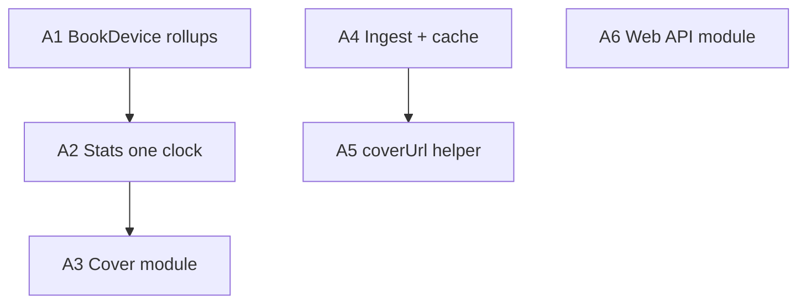

# Architecture deepening — agent handoff

Use this file with **`CONTEXT.md`** (domain terms) and **`REFACTOR-TODO.md`** (completed server refactor PRs 1–7). Architecture vocabulary (module, seam, depth, locality, leverage) lives in the `improve-codebase-architecture` skill’s `LANGUAGE.md`.

**Status (2026-05-27):** PRs 1–7 are **done**. This document captures the **next** deepening opportunities from an architecture review. Nothing here is started unless a section is marked done.

**HTML report (optional visual):** A Tailwind/Mermaid report was generated at review time under the OS temp dir (`architecture-review-20260527-kobuddy.html`). Regenerate with `/improve-codebase-architecture` if you want diagrams; this markdown file is the source of truth for implementation.

---

## Suggested agent workflow

1. Read `CONTEXT.md` invariants for the area you touch.
2. Pick **one** candidate below; do not mix unrelated deepenings in one PR.
3. Reuse test substrate: `apps/server/src/test-util/in-memory-db.ts`, `seed.ts`.
4. Update `CONTEXT.md` only if you sharpen domain terms or invariants.
5. Tick the candidate when landed; add **Completion notes** like `REFACTOR-TODO.md`.

**Suggested skills:** `improve-codebase-architecture`, `grill-with-docs` (if design is ambiguous), `verification-before-completion`, `test-driven-development` (especially candidates 1–2).

---

## Priority overview

| # | Candidate | Strength | Severity | Suggested order |
|---|-----------|----------|----------|-----------------|
| A1 | BookDevice rollup consolidation | Strong | Future drift / inconsistent rules | 1 |
| A2 | StatsOverview one clock + pipeline | Strong | **Wrong numbers** in non-UTC zones | 2 |
| A3 | Deepen Cover module (book-scoped ops) | Worth exploring | Route complexity, untested glue | 3 |
| A4 | Ingest composition + cache + shared import-sqlite | Worth exploring | Stale cache, duplicate paths | 4 |
| A5 | Single `coverUrl` at HTTP seam | Worth exploring | Low until URL contract changes | 5 |
| A6 | Web typed API module | Speculative | DX only | 6 |

**Top pair:** A1 then A2 — domain leverage plus a real `CONTEXT.md` invariant violation.



---

## Cross-cutting context (post PR 1–7)

**What landed well**

- Server modules: `books/`, `stats/`, `ingest/`, `covers/` with route glue.
- Ingest policy has module tests (`ingest/ingest.test.ts`).
- Visible/hidden filtering at module interfaces for stats and `statsForBook`.
- Wire DTOs in `@kobuddy/common`; web imports `BookListItem`, `StatsOverview`, etc.

**Test gaps**

| Area | Coverage |
|------|----------|
| `books/`, `ingest/`, `stats/`, `covers/` modules | Good (`*.test.ts` on server) |
| HTTP routes for books/covers/admin import-sqlite | Mostly untested except ingest cache spy in `stats.test.ts` |
| Web | No API/client tests |

**Known pass-through (deletion test fails)**

- `covers/index.ts`: `listCoverCandidates`, `listIsbnCandidates`, `readCoverBytes` → thin re-exports to `lookup.ts` / `storage.ts`.

---

## A1 — BookDevice rollup consolidation

**Recommendation:** Strong · **~LOC:** ~250–400

### Domain (from CONTEXT.md)

- **BookDevice** — per-Device rollup; composite PK `(bookMd5, deviceId)`.
- Consumers usually want **`max(...)`** across BookDevice rows for a Book.
- **Currently Reading Book** — unfinished visible Book with highest `max(lastOpen)`.
- **Shelf-eligible Book** — `max(totalReadPages) ≥ SHELF_MIN_READ_PAGES` (5) OR finished (`max(pages) > 0` AND `max(totalReadPages) ≥ max(pages)`).

### Files involved

- `apps/server/src/books/books.ts` — `listBooks` shelf `having`, inline `max(...)` aggs
- `apps/server/src/books/current-reading.ts` — `loadBookDeviceAggregates`, `pickCurrentReadingBookMd5`
- `apps/server/src/stats/stats-queries.ts` — `totalPagesRead`
- `apps/server/src/books/constants.ts` — `SHELF_MIN_READ_PAGES`
- Callers: `books/current-reading.test.ts`, `books/books.test.ts`, `stats/stats.test.ts`

### Current behavior (three copies of the same idea)

1. **`current-reading.ts`** — private `loadBookDeviceAggregates()` with `max(totalReadPages)`, `max(pages)`, `max(coalesce(lastOpen,0))`, groups by `bookMd5`, filters visible books.

2. **`books.ts` `listBooks`** — separate query with `max(totalReadPages)`, `max(pages)`, `max(lastOpen)` (note: not always identical `coalesce` usage vs current-reading), shelf `having` on `SHELF_MIN_READ_PAGES` / finished rule.

3. **`stats-queries.ts` `totalPagesRead`** — per visible book `max(totalReadPages)`, sum across books.

PR 1 **inlined** aggregates into `current-reading.ts` instead of sharing — intentional first cut; this candidate **completes** that work.

### Problem

- **Shallow duplication:** three modules each encode BookDevice rollup semantics; interface surface area is wide for maintainers.
- **Locality:** a rule change (e.g. how `lastOpen` treats zero, or shelf threshold) requires hunting three SQL shapes.
- **Risk:** shelf vs currently-reading vs stats totals can **drift** without a single test surface.

### User-visible symptoms (if drift happens)

- Book appears on home shelf but not as “currently reading” (or the reverse).
- `StatsOverview.totalPagesRead` disagrees with sum of per-book progress shown elsewhere.

### Proposed solution

- New module e.g. `apps/server/src/books/device-aggregates.ts` (name TBD; align with CONTEXT vocabulary):
  - `visibleBookDeviceAggregates(db)` → rows with `bookMd5`, `maxRead`, `maxPages`, `maxLastOpen`, `completedAt`, etc.
  - `pickCurrentlyReadingMd5(rows)` / or export `currentReadingBook` implementation using shared rows
  - `shelfEligibleHaving` or filter predicate shared with `listBooks`
  - `totalPagesReadFromAggregates(rows)` or keep SQL in one place used by stats
- `current-reading.ts`, `listBooks`, `totalPagesRead` become thin callers.

### Tests

- Migrate/extend cases from `current-reading.test.ts` and shelf cases from `books.test.ts` onto aggregate module tests.
- At least one multi-device Book case: two BookDevice rows, assert `max` picks correct device.

### Exit criteria

- Single source for `max(...)` across devices for visible books.
- All existing `books/*.test.ts` and stats tests green.
- Manual: home current book + shelf + dashboard total pages unchanged for a known DB.

### REFACTOR-TODO note

Completes unfinished consolidation after PR 1 (`book-device-aggregates.ts` was deleted and logic inlined).

**Completion notes (2026-05-27)**

- Added `books/book-device-aggregates.ts` (load, predicates, SQL fragments, `totalPagesReadVisible`).
- `current-reading.ts`, `listBooks`, `stats-queries.totalPagesRead` are thin callers.
- `listBooks` maps `lastOpen` via `mapLastOpenForWire` (aligned with current-reading).
- `CONTEXT.md`: **BookDevice aggregate (per Book)**.
- Tests: `book-device-aggregates.test.ts` (+ existing `books/*.test.ts` green).

---

## A2 — StatsOverview: one clock + clearer pipeline

**Recommendation:** Strong · **~LOC:** ~200–500 (fix can be small; pipeline collapse optional)

### Domain (from CONTEXT.md)

- **StatsOverview** — full dashboard DTO; **every** civil-calendar field honours caller IANA `timeZone`.
- Invariant: **One clock per response** — no server-local clock mixed in.

### Files involved

- `apps/server/src/stats/index.ts` — `statsOverview` orchestrator
- `apps/server/src/stats/aggregates.ts` — **bug:** `longestDay`, `last7DaysReadTime`, `mostPagesInADay` / `getPagesPerDay`
- `apps/server/src/stats/stats-tz.ts` — `localYmdParts` (correct pattern)
- `apps/server/src/stats/stats-dashboard.ts` — calendar, streaks, hourly, ISO week (already tz-aware)
- `apps/server/src/stats/stats-queries.ts`
- `apps/server/src/stats/stats.test.ts`

### Current behavior

`statsOverview(db, cfg, timeZone)` passes `timeZone` to:

- `getPerMonthReadingTime(stats, timeZone)` ✓
- `perDayOfTheWeek(stats, timeZone)` ✓
- `calendarByDayInZone`, streaks, hourly, week daily reading ✓

But **does not** pass `timeZone` to:

- `mostPagesInADay(stats)` — uses `startOfDay` in `getPagesPerDay` (server local via date-fns)
- `longestDay(stats)` — `startOfDay(toMs(stat.startTime))` server local
- `last7DaysReadTime(stats)` — `subDays(new Date(), 7)` server local

Relevant code:

```ts
// stats/index.ts — mixed
mostPagesInADay: mostPagesInADay(stats),
longestDaySeconds: longestDay(stats),
last7DaysReadTimeSeconds: last7DaysReadTime(stats),

// aggregates.ts — server clock
const day = startOfDay(toMs(stat.startTime)).getTime();
const sevenDaysAgo = subDays(new Date(), 7);
```

PR 2 fixed month/weekday tz but left these three on server clock.

### Problem

- **Violates CONTEXT invariant** — misleading interface: callers pass `timeZone` but three fields ignore it.
- **Navigation cost:** StatsOverview spread across five files; hard for agents/humans to verify one-clock.

### User-visible symptoms

User in e.g. `Asia/Tokyo` with evening reading sessions:

- Heatmap / streaks / calendar look correct (tz-aware).
- “Last 7 days reading time” or “longest day” disagree with what they infer from the heatmap.
- Worse on hosts running UTC (typical production).

### Proposed solution

**Phase 1 (correctness — do first):**

- Refactor `longestDay`, `last7DaysReadTime`, `mostPagesInADay` to accept `timeZone` and bucket via `localYmdParts` / same helpers as `stats-dashboard.ts`.
- Thread `timeZone` from `statsOverview`.
- Add regression tests: synthetic `PageStat` timestamps near local midnight boundary; assert bucketing changes when `timeZone` changes.

**Phase 2 (optional deepening):**

- Collapse assembly into e.g. `stats/build-overview.ts` with a single readable pipeline; keep `stats/index.ts` as thin re-exports.

### Exit criteria

- All `StatsOverview` civil-calendar fields use request `timeZone` in tests.
- `pnpm --filter @kobuddy/server test` green.
- Manual: `GET /api/stats?timeZone=Asia/Tokyo` vs `UTC` — `last7DaysReadTimeSeconds` / `longestDaySeconds` differ when data spans UTC midnight.

### Behaviour change

User-visible fix for non-UTC users. Flag in commit message for easy revert.

**Completion notes (2026-05-27, phase 1)**

- `longestDay`, `mostPagesInADay`, `last7DaysReadTime` take `timeZone` (+ `nowMs` for last 7); bucket via `localYmd`.
- `last7DaysReadTime` uses 7 civil days inclusive (today + prior 6), aligned with calendar heatmap.
- `addGregorianDays` moved to `stats-tz.ts` (re-exported from `stats-dashboard`).
- Regression tests in `stats.test.ts`.
- Phase 2: `build-overview.ts` (`loadOverviewBuildInput`, `buildStatsOverview`); `index.ts` is cache + book stats routes.

---

## A3 — Deepen Cover module (book-scoped operations)

**Recommendation:** Worth exploring · **~LOC:** ~400–700

### Files involved

- `apps/server/src/routes/books.ts` (~315 lines; cover/ISBN block ~108–250+)
- `apps/server/src/covers/index.ts`, `lookup.ts`, `storage.ts`
- `apps/server/src/books/books.ts` — `getBook`, `updateBook`
- `apps/web/src/components/AdminBookEditDialog.tsx`
- `apps/server/src/covers/covers.test.ts`

### Current behavior

- Cover **façade** exists but several exports are one-line pass-throughs to `lookup.ts`.
- Routes **bypass** Book module for cover flows:
  - Raw `db.select().from(book).where(eq(book.md5, md5))` on many handlers
  - Repeated: load book → `displayTitle(b)` → `listCoverCandidates(cfg, title, authors, isbn)`
  - `POST /:md5/cover/auto` builds candidate in route (optional body vs search first candidate)
  - `POST /:md5/isbn/auto` duplicates ISBN pick + DB update + `autoCoverAfterIsbnChange` instead of composing `updateBook` + cover policy

Example pattern in routes:

```ts
const [b] = await db.select().from(book).where(eq(book.md5, md5)).limit(1);
const title = q || displayTitle(b);
const candidates = await listCoverCandidates(cfg, title, authors, b.isbn);
```

Book list/detail already delegate to `listBooks` / `getBook` / `updateBook`; cover endpoints did not get the same treatment in PR 7.

### Problem

- **Seam leakage:** HTTP layer owns display/orchestration knowledge.
- **Shallow Cover interface:** real behaviour in routes + lookup; deletion test fails on façade wrappers.
- **Testing:** `covers.test.ts` covers module; route-only branches (query `q`, auto-cover without provider) need HTTP or new module tests.

### Proposed solution

- Book-scoped Cover API, e.g.:
  - `coverCandidatesForBook(db, cfg, md5, { query?: string })`
  - `isbnCandidatesForBook(db, cfg, md5, { query?: string })`
  - `applyAutoCoverForBook(db, cfg, md5, body?)`
  - `applyIsbnAutoForBook(db, cfg, md5, body?)` composing `updateBook` + `autoCoverAfterIsbnChange`
- Routes: `requireAdmin` + zod + one call.
- Fold or inline redundant `listCoverCandidates` re-exports if lookup is always internal.

### Tests

- Extend `covers/covers.test.ts` for book-scoped functions (in-memory DB + mocked fetch).
- Optional: one Hono route test per critical admin path.

### Exit criteria

- `routes/books.ts` cover/ISBN handlers ~5–10 lines each.
- No raw book fetch in cover handlers except inside Cover module.
- Admin cover flow works E2E manually.

**Completion notes (2026-05-27)**

- `covers/book-covers.ts` — book-scoped candidates, auto cover/ISBN, `serveCoverBytesForBook`, `applyCoverPolicyAfterBookUpdate`.
- `covers/cover-ops.ts` — apply/read/delete + `autoCoverAfterIsbnChange` (uses `getBookRow`).
- Removed public `listCoverCandidates` / `listIsbnCandidates` pass-throughs.
- `books/getBookRow`; `updateBook` normalizes ISBN via `normalizeIsbnForStorage`.
- `lib/urls.ts` — `bookCoverUrl` used in books routes + `build-overview`.
- `CurrentBookCard` — no client-side cover URL fallback.
- Tests: `covers.test.ts` book-scoped cases, `urls.test.ts`, ISBN normalize in `books.test.ts`.

---

## A4 — Ingest composition + cache invalidation + shared import-sqlite

**Recommendation:** Worth exploring · **~LOC:** ~150–300

### Domain (from CONTEXT.md)

- **Ingest → cache:** cache invalidation follows successful Ingest; **Ingest module does not know about cache** (correct — keep it).

### Files involved

- `apps/server/src/routes/ingest.ts` — 3 POSTs + `import-sqlite`; each `await invalidateStatsCache(db)` after success
- `apps/server/src/routes/books.ts` — `POST /import-sqlite` (admin); duplicate multipart glue
- `apps/server/src/stats/index.ts` — public `invalidateStatsCache`
- `apps/server/src/stats/stats-cache.ts` — implementation
- `apps/server/src/scripts/seed-dev-data.ts` — imports `stats-cache.js` **directly** (bypasses `stats/index`)

### Current behavior

**Duplicate `import-sqlite` handlers** (same steps, different auth/response/logging):

| Route | Auth | File |
|-------|------|------|
| `POST /api/ingest/import-sqlite` | Bearer ingest token | `routes/ingest.ts` |
| `POST /api/books/import-sqlite` | Admin session | `routes/books.ts` |

Shared steps: `parseBody` → validate `file` → `deviceIdFromMultipartField` → `ingestFromKoreaderSqlite` → `invalidateStatsCache` → JSON response.

**Cache invalidation call sites after ingest:** ingest `/device`, `/import`, `/import-sqlite`; books `/import-sqlite`.

### Problem

- **Locality:** new mutation path can forget `invalidateStatsCache` → stale **StatsOverview** (silent).
- **Duplication:** two import-sqlite paths can diverge (logging, error shape).
- **Seam leak:** seed script imports internal `stats-cache` instead of `stats/index`.

### Proposed solution

- Composition-root helper, e.g. `runIngestAndInvalidate(db, async () => ingestResult)` in `apps/server/src/lib/` or next to routes.
- Shared `importSqliteFromMultipart(db, file, deviceIdField)` used by both routers.
- `seed-dev-data.ts` imports `invalidateStatsCache` only from `stats/index.js`.

### Tests

- One test: helper always invalidates on success, never on thrown ingest.
- Optional: admin `POST /api/books/import-sqlite` cache clear (mirror existing ingest route test in `stats.test.ts`).

### Exit criteria

- Single implementation for sqlite multipart import.
- All ingest mutation paths use shared invalidation wrapper.
- Seed script uses public stats API only.

### REFACTOR-TODO note

PR 2 chose composition-root invalidation (good); PR 3 noted duplicate admin vs plugin import paths but did not unify.

**Completion notes (2026-05-28)**

- `lib/after-stats-affecting-mutation.ts` — composition-root invalidation with optional `invalidate(result)` predicate.
- `ingestKoreaderSqliteFromMultipart` in `ingest/index.ts` — shared multipart sqlite path; used by ingest + admin books routes.
- Removed cache bust on `POST /ingest/device` (device rows do not affect `StatsOverview`).
- Book admin mutations (hide, update, covers, ISBN auto, import-sqlite) use the helper; failed cover/ISBN auto does not invalidate.
- `seed-dev-data.ts` imports `invalidateStatsCache` from `stats/index.js`.
- Tests: `after-stats-affecting-mutation.test.ts`; stats route tests for ingest import/sqlite, books import-sqlite, hide; device no longer clears cache.

---

## A5 — Single `coverUrl` mapping at HTTP seam

**Recommendation:** Worth exploring · **~LOC:** ~50–120

### Domain

- DB/storage: **`coverPath`** (relative under `DATA_PATH`).
- Wire DTOs (`BookListItem`, `CurrentReadingBook`, etc.): **`coverUrl`** for browser.

Book module returns rows **without** `coverUrl` on purpose (`Omit<BookListItem, 'coverUrl'>`).

### Files involved

- `apps/server/src/routes/books.ts` — list + detail map `coverPath` → `/api/books/${md5}/cover`
- `apps/server/src/stats/index.ts` — `statsOverview` maps `currentRow.coverPath` → `coverUrl`
- `apps/web/src/components/CurrentBookCard.tsx` — client fallback if `coverUrl` empty

### Current behavior

Three copies of URL template:

```ts
coverUrl: b.coverPath ? `/api/books/${b.md5}/cover` : null
```

Web fallback:

```ts
const coverSrc = book.coverUrl?.trim() || `/api/books/${book.md5}/cover`;
```

### Problem

- Contract sprawl: URL shape change requires multiple edits.
- Book module callers must know HTTP URL rules (shallow seam).

### Proposed solution

- `bookCoverUrl(md5: string, coverPath: string | null): string | null` in e.g. `apps/server/src/lib/urls.ts` or `books/presentation.ts`.
- Use in books routes + `statsOverview`.
- Remove web fallback once server always sends `coverUrl` when `coverPath` exists.

### Tests

- Unit test: null path → null url; path set → expected path.

### Exit criteria

- One function owns cover URL shape.
- No duplicate template strings in routes/stats/web.

**Completion notes (2026-05-27)** — Shipped with A3: `lib/urls.ts` (`bookCoverUrl`).

### REFACTOR-TODO note

PR 5 deliberately placed mapping at “three route-layer one-liners” — this candidate centralizes that decision.

---

## A6 — Web typed API module

**Recommendation:** Speculative · **~LOC:** ~300–600

### Files involved

- `apps/web/src/api.ts` — generic `apiJson` only
- `apps/web/src/pages/HomePage.tsx`, `BooksPage.tsx`, `AdminBooksPage.tsx`
- `apps/web/src/components/AdminBookEditDialog.tsx` — ~11 `apiJson` call sites
- `apps/web/src/lib/hooks.ts` — only `useMe`
- `@kobuddy/common` — types already shared

### Current behavior

Pages build URLs inline:

```ts
apiJson<StatsOverview>(`/api/stats?${new URLSearchParams({ timeZone }).toString()}`)
apiJson<BookListItem[]>(`/api/books?${new URLSearchParams({ sort: 'lastOpen', limit: '8', shelf: 'true' })`)
```

No web tests; server has module boundaries, web does not.

### Problem

- Hard to discover all wire usage; query keys and paths can drift.
- Testing requires global `fetch` mock instead of a small API module.

### Proposed solution

- `apps/web/src/api/stats.ts`, `books.ts`, `auth.ts` (or flat `api/client.ts`) with typed functions.
- Thin React Query hooks in `lib/hooks.ts`.
- `AdminBookEditDialog` uses hooks, not raw paths.

### Exit criteria

- `pnpm build` green; no behaviour change intended.
- All `/api/*` paths used by web live in `api/`.

### Priority

Do after server candidates unless web feature work is the focus.

---

## Suggested PR slicing (if implementing all)

| PR | Candidate | Notes |
|----|-----------|-------|
| A1-pr1 | A1 BookDevice aggregates | Tests first; then wire list/current-reading/totalPagesRead |
| A2-pr1 | A2 tz fix only | Small, ship first within stats — correctness |
| A2-pr2 | A2 pipeline collapse | Optional follow-up |
| A3-pr1 | A3 Cover book-scoped | Largest route diff; manual admin E2E |
| A4-pr1 | A4 ingest wrapper + shared sqlite | Low risk |
| A5-pr1 | A5 coverUrl helper | Can ride with A3 or alone |
| A6-pr1 | A6 web api module | Pure DX |

---

## Review session metadata

- **Review date:** 2026-05-27
- **Base branch state:** REFACTOR-TODO PRs 1–7 complete
- **Explore agent transcript id (parent session):** `6d1f548d-87fd-4eeb-9b64-28c2ca344a93` — optional; this file supersedes it for implementation

---

## Completion log

_Tick candidates when done; add notes below each._

- [x] **A1** BookDevice rollup consolidation
- [x] **A2** StatsOverview one clock (+ build-overview pipeline)
- [x] **A3** Cover module deepening
- [x] **A4** Ingest + cache composition
- [x] **A5** coverUrl helper
- [ ] **A6** Web API module
